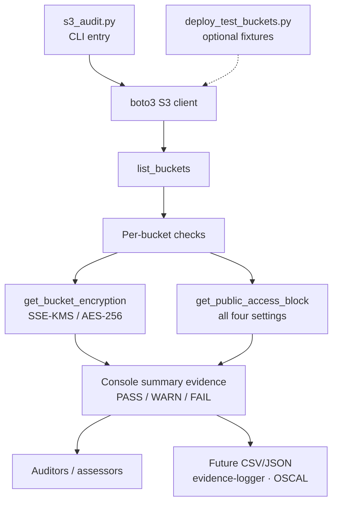

# S3 Audit

I built this to audit every S3 bucket in an AWS account for two things: encryption at rest and public access block enforcement. It's for GRC engineers, compliance analysts, and assessors working in FedRAMP High and CJIS v6.1 environments, where a bucket misconfiguration is direct evidence-handling risk.

## Compliance Controls Addressed

| NIST 800-53 Rev 5 | FedRAMP High | CJIS v6.1 | Validation Method |
|--------------------|:------------:|:---------:|-------------------|
| SC-28 Protection of Information at Rest | Yes | Agency-managed CMK required | `get_bucket_encryption` API check |
| SC-28(1) Cryptographic Protection | Yes | - | Verifies SSE-KMS or AES-256 algorithm |
| AC-3 Access Enforcement | Yes | - | `get_public_access_block` enforces deny-by-default |
| AC-21 Information Sharing | Yes | - | Public access block prevents inadvertent CJI exposure |
| CM-6 Configuration Settings | Yes | - | Verifies all four PAB settings are enabled |
| AU-12 Audit Record Generation | Yes | - | Every audit run produces compliance evidence |

## Overview

Two scripts:

1. **`s3_audit.py`**: Audits buckets for encryption and public access block compliance.
2. **`deploy_test_buckets.py`**: Creates test buckets with various configurations to exercise the audit script.

## Architecture Overview



Editable Mermaid source (kept in sync with the fence above): [`docs/architecture.mmd`](docs/architecture.mmd).

`s3_audit.py` lists every bucket, then checks encryption-at-rest (SC-28) and public access block (AC-3 / CM-6) per bucket. Findings print as a console PASS/WARN/FAIL summary for assessors today; CSV/JSON export is the planned handoff into evidence-logger / OSCAL. `deploy_test_buckets.py` is an optional fixture path for local exercise.

## Requirements

- Python 3.x
- `boto3` library
- AWS CLI configured with credentials (`aws configure`)

### Install dependencies

```bash
pip install boto3
```

## Usage

### Run the audit

```bash
python s3_audit.py
```

**Sample output:**

```
Found 4 buckets.

Checking bucket: my-secure-bucket
    [PASS] Encryption: AES256
    [PASS] Public Access Block: Enabled
Checking bucket: my-partial-bucket
    [PASS] Encryption: AES256
    [WARN] Public Access Block: Partially configured
Checking bucket: my-insecure-bucket
    [PASS] Encryption: AES256
    [FAIL] Public Access Block: Not configured

========================================
Summary: 1 of 3 buckets fully compliant.
```

### Deploy test buckets (optional)

```bash
python deploy_test_buckets.py
```

Creates 3 buckets with different configurations to test the audit script:

| Bucket | Public Block | Expected Result |
|--------|--------------|-----------------|
| `grce-audit-compliant-<account_id>` | Full | PASS |
| `grce-audit-no-block-<account_id>` | None | FAIL |
| `grce-audit-partial-<account_id>` | Partial | WARN |

## Compliance Checks

### 1. Encryption (SC-28, SC-28(1))

Verifies server-side encryption (SSE) is enabled.

- **PASS**: Encryption configured (AES-256 or SSE-KMS)
- **FAIL**: No encryption configured

### 2. Public Access Block (AC-3, AC-21, CM-6)

Verifies all four public access block settings are enabled:

- `BlockPublicAcls`
- `IgnorePublicAcls`
- `BlockPublicPolicy`
- `RestrictPublicBuckets`

- **PASS**: All 4 enabled
- **WARN**: Partial (some enabled)
- **FAIL**: None enabled

## How an Auditor Uses This Output

An assessor reviewing a FedRAMP High or CJIS v6.1 authorization package can run this script across the in-scope account to verify that every bucket holding regulated data satisfies the SC-28 (encryption at rest) and AC-3 / AC-21 (public access prevention) controls. The PASS / WARN / FAIL output maps directly to the assessor's adequacy determination: PASS is satisfied, WARN is a partial finding requiring remediation, FAIL is a control deficiency. Combining this run with `cloudtrail-audit` (logging) and `evidence-logger` (timestamped evidence packaging) produces the audit trail an assessor can reference back to NIST 800-53A assessment objectives.

## FedRAMP 20x Alignment

This script supports the FedRAMP 20x compliance-as-code direction by producing deterministic, automatable, and re-runnable control validation output. The boto3 API calls map cleanly to KSI metrics for continuous monitoring, and the per-bucket findings can be transformed into OSCAL Assessment Results entries for machine-readable compliance reporting. Future iterations will emit JSON output (see Future Enhancements) to feed compliance-trestle and OSCAL pipelines directly.

## CJIS v6.1 Relevance

CJIS Security Policy v6.1 (released June 25, 2026) is the current policy, aligned with NIST 800-53 Rev 5. v6.x has been the default audit baseline since April 1, 2026 (v5.9.5 sunset March 31, 2026); modernized Priority 2-4 controls are fully enforceable Oct 1, 2027 (timing varies by state CSA). The most material delta this script touches is **SC-28**: CJIS v6.1 requires encryption at rest using **agency-managed Customer Master Keys (CMKs)** for buckets storing CJI. AWS-managed encryption (AES-256 / SSE-S3) satisfies FedRAMP High SC-28 but does **not** satisfy CJIS v6.1: agencies must provision their own KMS CMKs and configure SSE-KMS with those CMKs. A future enhancement to this script will report the encryption *key source* (not just whether encryption is on) to surface this delta during an audit.

## Roadmap

This tool will be consolidated into the **Unified Evidence Collector** (Project 4, Month 7), which aggregates `s3-audit`, `sg-audit`, `cloudtrail-audit`, and `evidence-logger` into a single pipeline producing OSCAL-ready evidence records. The agency-CMK key-source delta check noted under *CJIS v6.1 Relevance* ships as part of that consolidation, alongside JSON output feeding [`oscal-evidence-pipeline`](https://github.com/0xBahalaNa/oscal-evidence-pipeline) as a Component Definition source.

## Cleanup

Delete test buckets when done to avoid charges:

```bash
aws s3 rb s3://grce-audit-compliant-<your_account_id>
aws s3 rb s3://grce-audit-no-block-<your_account_id>
aws s3 rb s3://grce-audit-partial-<your_account_id>
```

## Future Enhancements

- Export results to CSV / JSON for downstream OSCAL pipelines
- Report encryption key source (CMK ARN) to surface the CJIS SC-28 agency-CMK delta
- Add timestamp + structured findings record (feeds `evidence-logger`)
- Check bucket versioning (SI-12: Information Management & Retention)
- Check bucket logging (AU-2)
- Filter buckets by tag (in-scope CJI vs general data)
- SNS / email alerts for non-compliant buckets

## Framework Reference

Control family mappings and AWS implementation details are documented in [nist-800-53-rev-5-to-aws-mapping](https://github.com/0xBahalaNa/nist-800-53-rev-5-to-aws-mapping).

## License

MIT
